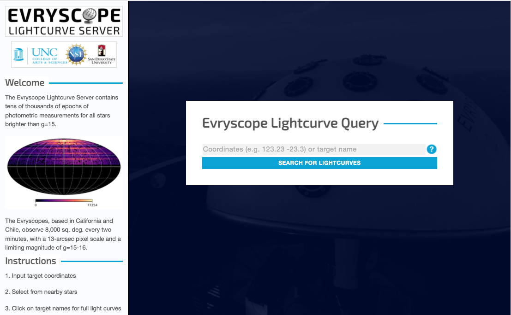
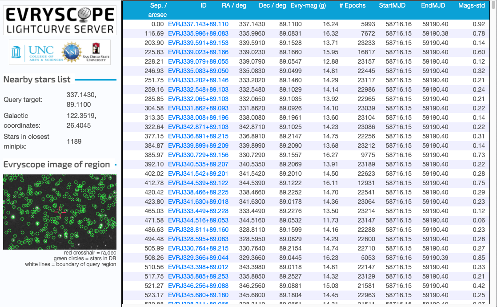

# lightcurve

**Evryscope Lightcurve Data Server**

As of January 2022, roughly 1.3 million data files make up the Evryscope lightcurve server data -- most with the extension `.evrlc` on them.  The total size is about 2TB.

Access to the original data was provided by UNC Dept. of Physics (Nick Law, Hank Corbett), and the data was copied from Google cloud storage to RENCI's S3 storage.

A copy of the original web server (python Flask code) was also provided, and is saved here in: `evryscope_lc_service.tar.gz`

A subset of the original code is reused here to deploy the server to RENCI infrastructure, initially on the Sterling cluster in the argus-dev namespace.

The code was modified to use "boto3" for S3 api access from its original google cloud storage access.

## Building the docker image

```
docker build -t wtstephens/lcservice:0.0.2 .

docker push wtstephens/lcservice:0.0.2
```

## Running the image locally

In order to run locally, set the environment values `S3_ACCESS_KEY_ID` and `S3_SECRET_ACCESS_KEY` to the values for the **lightcurve-admin** user.  However, the main page will (mostly) load without these values.

The image can be run locally to check its functionality.
```
docker compose build
docker compose up
```
And then opening `localhost:8080/` in the browser.

Or by:
```
docker run -p 8080:8080 -e S3_ACCESS_KEY_ID=${S3_ACCESS_KEY_ID} -e S3_SECRET_ACCESS_KEY=${S3_SECRET_ACCESS_KEY} wtstephens/lcservice:0.0.1

# other
docker run -it --entrypoint /bin/bash wtstephens/lcservice:0.0.1
```

## Deployment to Sterling

In the `deployment` folder are instructions on how the server is deployed to argus-dev.

## Sample lightcurve screenshots

Evryscope lightcurve-server home page:



Enter, for example, `337.143 89.11` and click the search button to get a list:


